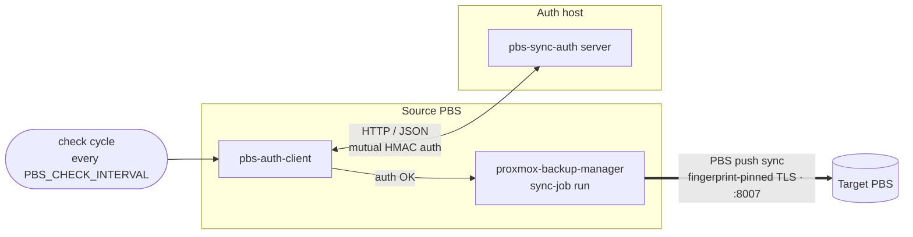

# pbs-sync-auth

A small authentication gatekeeper that lets a **Proxmox Backup Server (PBS)** run
its offsite **push sync** *only* when it can reach — and cryptographically verify
— a trusted counterpart over the network. It is **not** a backup transport; it
only decides *whether* the push is allowed to run right now.

## Why

A PBS should push its backups to an offsite target only when it is actually on the
trusted network. A plain reachability check (ping/port) is forgeable. Instead, a
client and server perform a **mutual cryptographic authentication**
(HMAC-SHA256 challenge-response). Only when both sides prove they hold the same
shared secret does the client trigger the local push sync job.

Both programs use the **Go standard library only** — no external modules.

## Components

    client/   Go daemon on the source PBS (systemd service). On each interval, on
              successful auth: `proxmox-backup-manager sync-job run <job>`.
    server/   Go HTTP service, runs as a Docker container on a host reachable
              by the source PBS.
    docs/     PBS-side setup guides (source and target).

## Data flow

The thin link is the **auth handshake** (HTTP/JSON, mutual HMAC); the thick link
is the **actual backup transfer**, which goes straight from source to target over
the PBS-native, fingerprint-pinned TLS connection. The auth service transfers
**no** backup data — it only decides whether the push may run.

## Protocol

Shared secret `K` (32 bytes, hex) in `/etc/pbs-sync-auth/secret.key`, identical on
client and server.

    mac(tag, cn, sn) = HMAC-SHA256(K, "tag|cn|sn")   (tag ∈ {"server","client"})

1. `POST /auth/challenge  {"client_nonce": cn}`
   Server → `{"server_nonce": sn, "server_proof": mac("server", cn, sn)}`
   The client verifies `server_proof` → **the server is genuine**.
2. `POST /auth/verify  {"client_nonce": cn, "server_nonce": sn, "client_proof": mac("client", cn, sn)}`
   Server verifies `client_proof` → `{"status":"ok"}` / `401` → **the client is authorized**.

Security properties: fresh nonces on both sides (replay protection), domain
separation `server`/`client` (no reflection attack), single-use challenges with a
30 s TTL, constant-time comparison (`hmac.Equal`). The authentication is therefore
unforgeable even over plain HTTP — only the random nonces are visible on the wire.

## Quick start (local handshake test)

    # generate the shared secret
    openssl rand -hex 32 > secret.key

    # start the server
    PBS_AUTH_SECRET=./secret.key PBS_AUTH_PORT=8099 go run ./server &

    # run the client against it
    PBS_AUTH_SECRET=./secret.key PBS_AUTH_URL=http://127.0.0.1:8099 go run ./client

See [`server/README.md`](server/README.md) and [`client/README.md`](client/README.md)
for building and deploying, and [`docs/`](docs/) for the PBS-side setup.

## Installation

### 1. Shared secret (both sides)

Generate the 32-byte secret **once** and copy the same file to both the server and
the source PBS:

    openssl rand -hex 32 > secret.key    # keep it safe, never commit it

### 2. Server (auth host) — Docker

Run the published multi-arch image (x86_64 / arm64 / armv7, incl. Raspberry Pi
3/4/5) on a host the source PBS can reach:

    docker run -d --name pbs-auth-server \
      -p 8099:8099 \
      -v "$PWD/secret.key:/run/secrets/pbs_auth_secret:ro" \
      -e PBS_AUTH_SECRET=/run/secrets/pbs_auth_secret \
      --read-only --security-opt no-new-privileges \
      ghcr.io/ftaeger/pbs-sync-auth:latest

Optionally add `-e PBS_TARGET_URL=https://pbs-target.example.com:8007` so the
server only returns OK once the target PBS API is reachable — otherwise the client
skips the sync and logs that the central PBS is unavailable (see
[`server/README.md`](server/README.md)).

The server speaks plain HTTP on `:8099`; put a reverse proxy in front for TLS.
Ready-to-use reverse-proxy examples are in [`examples/`](examples/): **Traefik**
(automatic Let's Encrypt, HTTP-01 or Cloudflare DNS-01) plus **nginx**, **Caddy**,
**HAProxy**, **Apache httpd** and **Envoy** (TLS termination, bring your own
certificate). A standalone binary + systemd variant is in
[`server/README.md`](server/README.md).

### 3. Client (source PBS)

> On a PBS you operate as **root**, so the client commands below use **no `sudo`**.

Choose one of the two install options, then configure and enable.

**Option A — APT repository (recommended, updates via `apt upgrade`)**

    curl -fsSL https://ftaeger.github.io/pbs-sync-auth/pubkey.asc \
      | gpg --dearmor > /usr/share/keyrings/pbs-sync-auth.gpg

    echo "deb [signed-by=/usr/share/keyrings/pbs-sync-auth.gpg] \
      https://ftaeger.github.io/pbs-sync-auth stable main" \
      > /etc/apt/sources.list.d/pbs-sync-auth.list

    apt update && apt install pbs-sync-auth-client

**Option B — manual, single `.deb`**

Download `pbs-sync-auth-client_X.Y.Z_amd64.deb` from the
[releases page](https://github.com/ftaeger/pbs-sync-auth/releases) and install it:

    apt install ./pbs-sync-auth-client_X.Y.Z_amd64.deb

(For a plain-binary install without a package, see
[`client/README.md`](client/README.md).)

**Configure and enable (both options)**

    # 1) configure: auth server, sync job, and how often to check / back up
    $EDITOR /etc/pbs-sync-auth/client.conf
    #   PBS_AUTH_URL, PBS_SYNC_JOB, PBS_CHECK_INTERVAL, PBS_MIN_BACKUP_INTERVAL

    # 2) install the shared secret (the SAME secret.key as on the server)
    install -m 600 secret.key /etc/pbs-sync-auth/secret.key

    # 3) enable and start the daemon
    systemctl enable --now pbs-sync-auth.service

Watch it:

    systemctl status pbs-sync-auth.service
    journalctl -u pbs-sync-auth.service -f

The PBS-side setup (remote, push sync job, permissions) is in
[`docs/pbs-source.md`](docs/pbs-source.md) (source) and
[`docs/pbs-target.md`](docs/pbs-target.md) (target).

## Configuration

Environment variables (see the component READMEs for defaults):

    PBS_AUTH_SECRET         path to the shared secret (default /etc/pbs-sync-auth/secret.key)
    PBS_AUTH_URL            client: auth server base URL (http:// or https://)
    PBS_AUTH_PORT           server: listen port (default 8099)
    PBS_SYNC_JOB            client: PBS sync job to run (default offsite-push)
    PBS_CHECK_INTERVAL      client: how often the daemon runs a cycle (default 30m)
    PBS_MIN_BACKUP_INTERVAL client: min time between successful syncs (default 0 = every check)
    PBS_AUTH_TIMEOUT        client: HTTP timeout (default 3s)
    PBS_AUTH_TLS_VERIFY     client: verify the server cert on https (default true)
    PBS_AUTH_TLS_CA         client: optional PEM CA bundle to trust (internal CA)
    PBS_TARGET_URL          server: optional target-PBS reachability gate (e.g.
                            https://pbs-target.example.com:8007; unset = disabled)
    PBS_TARGET_TIMEOUT      server: probe timeout for the gate (default 3s)

## TLS (defense in depth)

For an `https://` `PBS_AUTH_URL`, the client performs the TLS handshake as the
**first gate** — if certificate verification fails it aborts before the HMAC
round. A publicly trusted certificate (e.g. Let's Encrypt via the Traefik
example) needs no extra client config; `PBS_AUTH_TLS_CA` trusts an internal CA,
and `PBS_AUTH_TLS_VERIFY=false` disables verification for testing only. The mutual
HMAC authentication always runs **in addition** to the TLS check, never instead
of it — so the gate stays unforgeable even over plain HTTP.

## Conventions

- **Go: standard library only** — do not add external dependencies.
- Target architecture **linux/amd64**, `CGO_ENABLED=0`, static binary.
- Container: `scratch` base, non-root (65534), read-only; secret mounted
  read-only.
- Never commit the shared secret (`secret.key` is in `.gitignore`).

## License

[MIT](LICENSE) © 2026 Florian Taeger
